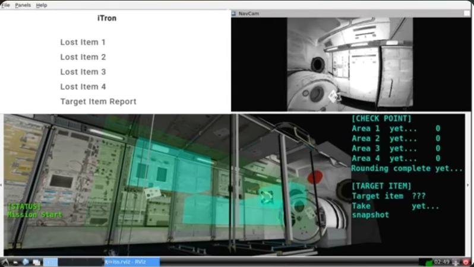
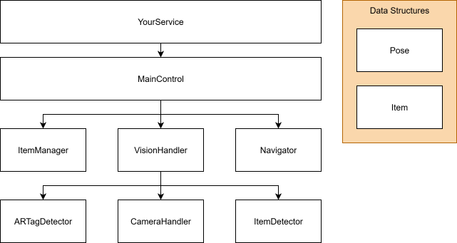
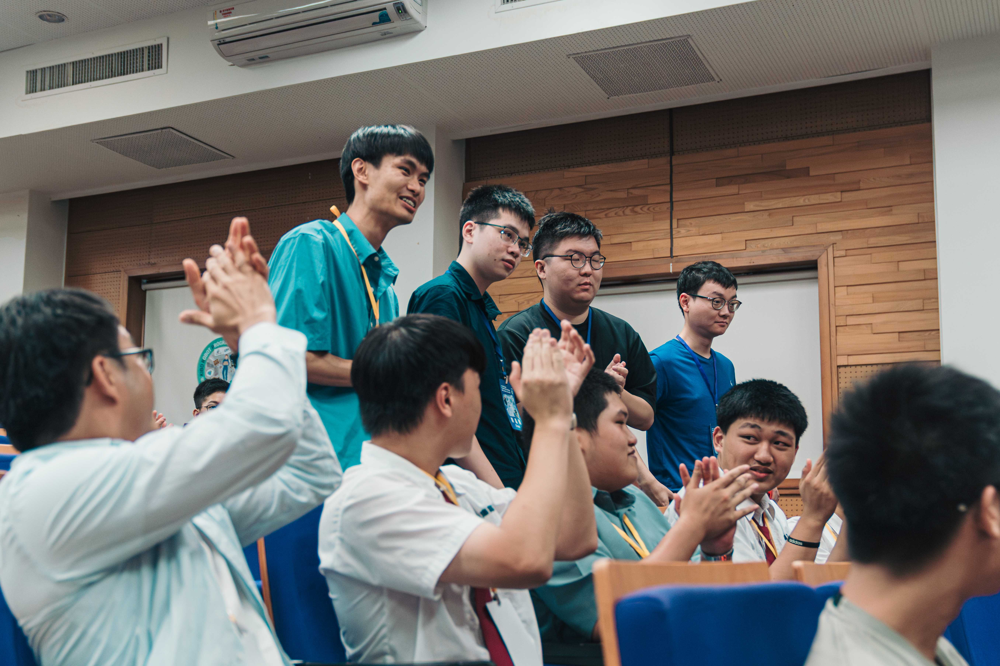
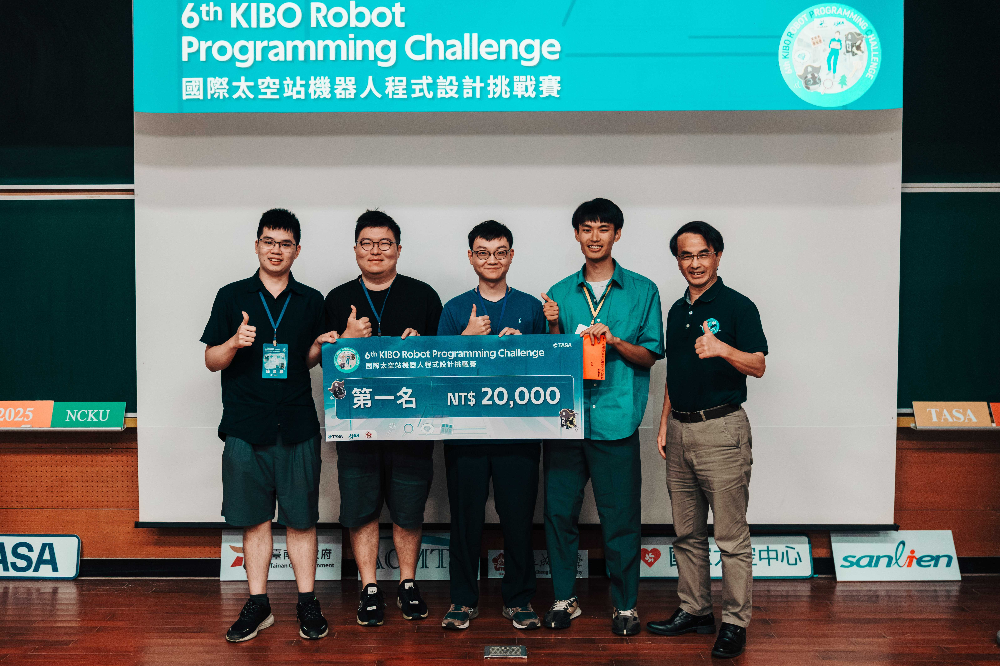

# kiborpc-2025

A reproducible, competition-proven Astrobee autonomy system that pairs high-precision vision (YOLOv11 + WBF + distortion correction) with reliable navigation to maximize Kibo-RPC (Kibo Robot Programming Challenge) scores.

- [kiborpc-2025](#kiborpc-2025)
  - [Watch](#watch)
  - [Overview](#overview)
  - [Technical Highlights](#technical-highlights)
  - [Repository Layout](#repository-layout)
  - [Prerequisites and Installation](#prerequisites-and-installation)
  - [Build (Makefile)](#build-makefile)
  - [Documentation](#documentation)
  - [Architecture](#architecture)
  - [Timeline](#timeline)
  - [Results and Media](#results-and-media)
  - [Related Work](#related-work)
  - [Useful links](#useful-links)

## Watch



- **Quick Demo (1 min)**: https://www.youtube.com/live/56YUyxNEy1s?si=wy63iy8F2a4zJ0mo&t=5686
- **Full Report Livestream (4 - 5 min)**: https://www.youtube.com/live/56YUyxNEy1s?si=bcGWKDyTscnZprXh&t=5424

## Overview

[]()
[]()
[]()

-	Designed modular control system for ISS Astrobee robot
-	Implemented YOLOv11-based object detection with custom synthetic dataset, image distortion correction, and revised Weighted Box Fusion algorithm
-	Achieved 99% detection accuracy and an average simulation score of 286.8 points
- Won 1st place on preliminary round

## Technical Highlights

- **YOLOv11** object detection, **ARTag** detection, and **Weighted Box Fusion**.
- **Dockerized build environment** to compile on any computer.
- **Doxygen** for documents about APIs to speed up developement.

## Repository Layout

```
.
├─ app/                     # Android app sources
│ └─ app/src/main/java/jp/jaxa/iss/kibo/rpc/sampleapk/
│ ├─ CameraHandler.java     # camera capture + undistortion
│ ├─ ARTagDetector.java     # ARTag detection + image clipping
│ ├─ ItemDetector.java      # YOLOv11 wrapper + Image and Result Processing
│ ├─ VisionHandler.java     # integrates Camera/ARTag/YOLO
│ ├─ Navigator.java         # motion, planning, sensor handling
│ ├─ ItemManager.java       # item state store
│ └─ MainControl.java       # top-level state machine
├─ assets/                  # screenshots, photos, sample data
├─ docker/                  # dev container / compose files
├─ docs/                    # slides, notes, progress, Doxygen cfg
├─ python/                  # scripts or helpers
├─ vm/                      # model artifacts / training/export
├─ Makefile
└─ README.md
```

## Prerequisites and Installation

This project use [Git LFS](https://git-lfs.com/) to manage the model files.
Before cloning the repository, install Git LFS.

```sh
# Ubuntu/Debian
sudo apt install git-lfs
# Arch
yay -S git-lfs

# One-time setup per machine
git lfs install

# Clone (LFS files will download automatically)
git clone git@github.com:NYCU-iTron/kiborpc-2025.git
```

If for any reason the large files are not downloaded, you can run:

```sh
git lfs pull
```

> Windows tip: if you hit path-length issues, enable long paths: `git config --global core.longpaths true`.

Also, install docker following this [guide](https://docs.docker.com/engine/install/).

## Build (Makefile)

There are four targets, each with a different function:

```sh
# 1) Enter dockerized build environment
make

# 2) Compile APK inside Docker
make build
# → outputs to app/app/build/outputs/apk/debug/

# 3) Open the project in Android Studio
make studio

# 4) Generate Doxygen documentation and open the homepage
make doxygen
```

## Documentation

- Download a pdf report: [Kibo 競賽報告書.pdf](docs/Kibo%20競賽報告書.pdf)
- To see generated API docs with doxygen, use the command specified in [Build \(Makefile\)](#build-makefile)

## Architecture

Code structure:



Image pipeline:


- [CameraHandler](./app/app/src/main/java/jp/jaxa/iss/kibo/rpc/sampleapk/CameraHandler.java)
  - Take pictures and process the image.
- [ARTagDetector](./app/app/src/main/java/jp/jaxa/iss/kibo/rpc/sampleapk/ARTagDetector.java)
  - Detect AR tags.
- [ItemDetector](./app/app/src/main/java/jp/jaxa/iss/kibo/rpc/sampleapk/ItemDetector.java)
  - Detect items using yolo model.
- [VisionHandler](./app/app/src/main/java/jp/jaxa/iss/kibo/rpc/sampleapk/VisionHandler.java)
  - Integrate CameraHandler, ARTagDetector and ItemDetector.
- [Navigator](./app/app/src/main/java/jp/jaxa/iss/kibo/rpc/sampleapk/Navigator.java)
  - Move to the target.
  - Path planning.
  - Deal with the sensor error.
- [ItemManager](./app/app/src/main/java/jp/jaxa/iss/kibo/rpc/sampleapk/ItemManager.java)
  - Store the items information.
- [MainControl](./app/app/src/main/java/jp/jaxa/iss/kibo/rpc/sampleapk/MainControl.java)
  - Integrate Navigator, VisionHandler and ItemManager.
  - Determine the current state.

## Timeline

- 4/1: Simulator release
- 6/19: First round apk submit
- 7/13: Presentation

For more details, see [Progress](./docs/progress/progress.md)

## Results and Media

Preliminary Round:

- We achieved the 1st place in the preliminary round.
- The [slide](./docs/slides/slides.pdf) and [presentation script](./docs/notes/presentation_script.md) we used.
- [Live Record on Youtube](https://www.youtube.com/live/56YUyxNEy1s?t=5424s)
<p align="center">
  
  
</p>

Final Round: Not finished yet, date TBD

## Related Work

- [5th-KIBO](https://github.com/KIBO-Astronut/5th-KIBO)
  - The team from Tailand, winning the 1st place in 5th.
- [Kibo-RPC](https://github.com/Kobe-uni-Hyperion/Kibo-RPC)
  - The team from Japan
- [kibo-2024](https://github.com/Team-Cartographer/kibo-2024)
- [kiborpc-2023](https://github.com/Team-Cartographer/kiborpc-2023)
- [3rd-Kibo-RPC_won-spaceYPublic](https://github.com/M-TRCH/3rd-Kibo-RPC_won-spaceY)
- [2ndKIbo-RPC_Indentation-Error](https://github.com/wtarit/2nd-Kibo-RPC_Indentation-Error?tab=readme-ov-file)

## Useful links

- [2025競賽內容](https://2025kiborpc.ncku.edu.tw/%E7%AB%B6%E8%B3%BD%E5%85%A7%E5%AE%B9)
- [Astrobee Command API](https://nasa.github.io/astrobee/v/develop/command_dictionary.html)
- [Kibo Robot Programming Challenge official website](https://jaxa.krpc.jp/)
  - [6th Kibo-RPC Tutorial Video: 01 How to Login to My Page](https://youtu.be/PPwQDeAJsqg?si=ljjorvINLsrGOTF3)
  - [6th Kibo-RPC Tutorial Video: 02 How to Set up Android Studio](https://youtu.be/bN47LxLWkbU?si=dVKal4-G-o9Y2tIs)
  - [6th Kibo-RPC Tutorial Video: 03 How to Build APK and Simulator](https://youtu.be/LeC3sIL1sWE?si=6Vczm36ZKfC2GNsv)