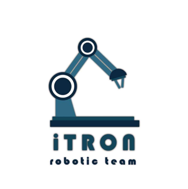
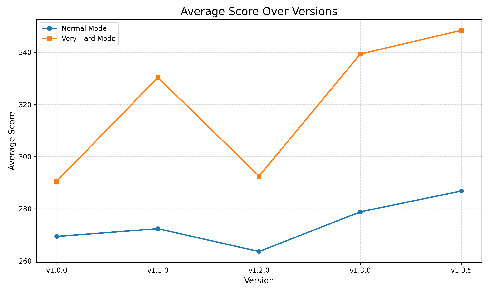

# Kibo-RPC 2025

K34-iTron

---

## Outline

1. Code Structure
2. Image Pipeline
3. Challenges & Solutions

---

## Code Structure

<!-- 
    - Data Structures:
      - Custom Pose and Item for storing information
    - Upper Layer:
      - YourService: The entrypoint
      - MainControl: The main logic
    - Lower Layer:
      - ItemManager: Store the information get by VisionHandler
      - VisionHandler: Handle the camera and interpretation of captured image
        - The pipeline will be shown in the next slide
      - Navigator: Get current pose and navigate to designated coordinates
 -->

---

## Image Pipeline

<!-- 
    - CameraHandler: get undistorted image
    - ARTagDetector: get clipped image based on the ARTag pose
    - ItemDetector:
      - Preprocess: Resize the image, then apply normalization and type casting
      - Reference: Run TensorFlow Lite model
      - Postprocess: Extract valid bounding boxes, class scores, and class labels
      - Weighted Box Fusion: A custom one, merging overlapping bounding boxes across different classes. Then Select the best class based on weighted confidence.
 -->

---

## Challenges and Solution

| Challenge | Solution |
| --- | --- |
| Programming Mannual has no detail about class `KiboRpcService` | Decompile code using android studio |
| Fail simulation doesn't provide log | Test and record reasons of failure for future reference |
| Training is slow on laptop | Ask Professor for a GPU instance on Google Cloud Platform

<!-- Append and adjust font size if there is more -->

---

## Thank You for Listening!

