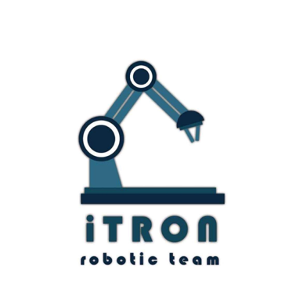
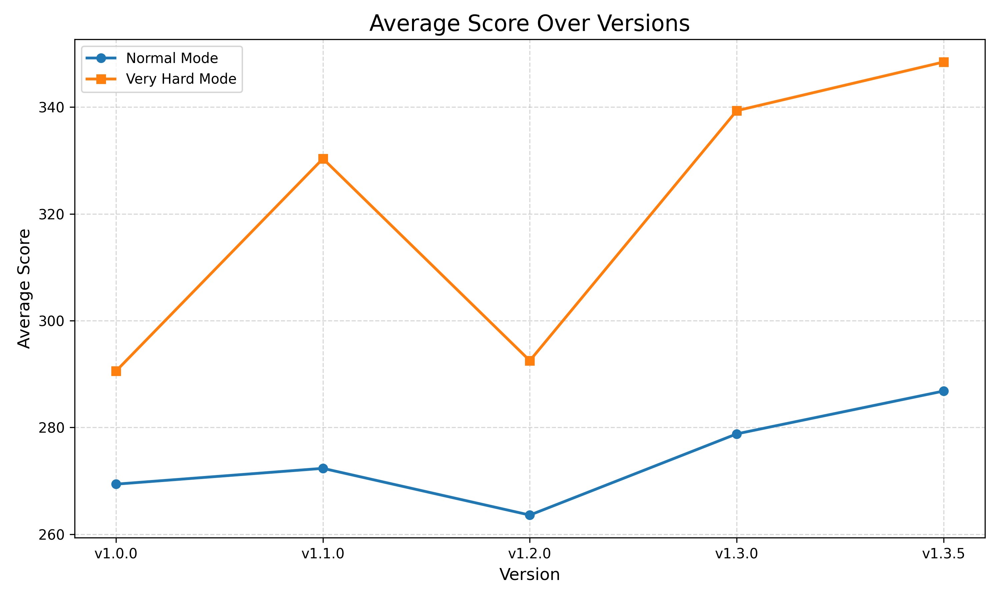

<!-- _class: lead -->



# Kibo-RPC 2025 賽後分享

<!--
講者備註｜約 0:30
今天不重講比賽規則，也不展示大量辨識畫面；重點是我們怎麼把一個機器人任務拆成可開發、可計算、可驗證的系統。
-->

---

## 總覽

1. **系統**｜任務如何拆成模組與流程
2. **計算**｜座標、位姿與安全目標
3. **策略**｜路線取捨與失敗處理
4. **工具**｜開發、測試與版本驗證

<!--
講者備註｜約 0:30
接下來先從整體架構與資料流開始，再談實際用到的座標、姿態與導航計算；最後分享如何做路線取捨、容錯，以及我們用哪些工具驗證版本。
-->

---

## Key Takeaways

1. **釐清任務流程、資料流與模組責任**
2. **在幾何計算中標示對應的座標系**
3. **用可量測的成本比較策略**
4. **以大量模擬的平均值做決策，不追單次高分**

<!--
講者備註｜約 0:45
這四點會一路對應到後面的架構、計算、導航、容錯與驗證方式。
-->

---

## 閉環

```text
任務目標
  ↓
規劃下一個目標位姿
  ↓
Astrobee 執行 moveTo
  ↓
讀取目前位置、姿態與任務回傳
  ↓
檢查執行結果與偏移
  ├─ 正常 → 下一狀態
  └─ 異常 → 重試 / 恢復 / 降級處理
```

**程式依照「觀測 → 決策 → 動作 → 驗證」的循環推進。**

<!--
講者備註｜約 0:50
除了依序呼叫 API，每個階段也會確認目前狀態，再決定進入下一步或採取其他處理。後續模組都沿用這個結構。
-->

---

## 系統架構

```text
YourService                       競賽框架入口
└─ MainControl                    任務狀態與模組協調
   ├─ Navigator                   位姿量測、移動、目標生成
   ├─ JitterHandler               偏移偵測與恢復
   ├─ VisionHandler               感知流程的單一入口
   │  ├─ CameraHandler
   │  ├─ ARTagDetector
   │  └─ ItemDetector
   └─ ItemManager                 任務資訊與 API 回報

共同資料：Pose（位置、姿態）
          Item（區域、種類、數量、位置）
```

<!--
講者備註｜約 0:55
YourService 很薄，只負責進入 MainControl。MainControl 不碰 OpenCV 或四元數細節；Navigator 也不知道物件辨識。分層讓每一組能獨立開發，出問題時也容易定位。
-->

---

## 位置轉換

已知 B 在 A 中的位置與旋轉，以及 C 在 B 中的位置：

$$
p^A_C=p^A_B+R^A_B p^B_C
$$

```text
C 在 B 座標中的位置
  → 依 B 相對 A 的姿態旋轉
  → 加上 B 在 A 中的位置
  → 得到 C 在 A 座標中的位置
```

<!--
講者備註｜約 1:00
`composePoses()` 先將 B 座標中的位置旋轉到 A，再加上兩個座標系之間的位移。程式也會合成四元數，但後續尋找寶物時使用的是標記位置。
-->

---

## 轉換矩陣

把「旋轉後再平移」合併成一次矩陣乘法：

$$
\begin{bmatrix}
x^A\\y^A\\z^A\\1
\end{bmatrix}
=
\underbrace{
\left[
\begin{array}{ccc|c}
\color{#087e8b}{r_{11}} & \color{#087e8b}{r_{12}} & \color{#087e8b}{r_{13}} & \color{#d97706}{t_x}\\
\color{#087e8b}{r_{21}} & \color{#087e8b}{r_{22}} & \color{#087e8b}{r_{23}} & \color{#d97706}{t_y}\\
\color{#087e8b}{r_{31}} & \color{#087e8b}{r_{32}} & \color{#087e8b}{r_{33}} & \color{#d97706}{t_z}\\ \hline
0 & 0 & 0 & 1
\end{array}
\right]}_{T^A_B}
\begin{bmatrix}
x^B\\y^B\\z^B\\1
\end{bmatrix}
$$

<div style="display:flex; justify-content:center; gap:70px;">
  <span style="color:#087e8b"><b>旋轉 R：改變座標軸方向</b></span>
  <span style="color:#d97706"><b>平移 t：B 在 A 中的位置</b></span>
</div>

<!--
講者備註｜約 1:00
矩陣中的平移 t 就是前一頁的 p^A_B。右邊是點在 B 座標中的數值，乘上 T 之後，左邊得到同一點在 A 座標中的數值。最後補上的 1 是齊次座標，讓平移也能包含在矩陣乘法中。
-->

---

## 座標串接

```text
OpenCV Camera ──→ NavCam ──→ Astrobee Body ──→ World
     Tᴺ_C            Tᴮ_N              Tᵂ_B
```

$$
\begin{bmatrix}p^W_{Tag}\\1\end{bmatrix}
=T^W_B\;T^B_N\;T^N_C
\begin{bmatrix}p^C_{Tag}\\1\end{bmatrix}
$$

<!--
講者備註｜約 0:50
程式從 ArUco 的 tvec 取得標記在 OpenCV Camera 座標中的位置，再依序轉到 NavCam、Astrobee Body，最後得到 World 座標。連乘式由右向左讀，正好對應這個轉換順序。
-->

---

## 目標位姿

```text
量測位置
  → 限制在目標平面的範圍內
  → 沿平面法向保留安全距離
  → 目標位姿
```

$$
p_{target}
=\operatorname{clamp}_{plane}(p_{measured},\ bounds-m)
+d_{safe}\,n
$$

- $n$：目標平面的法向
- $d_{safe}$：與平面保持的距離
- $m$：邊界安全餘裕

<!--
講者備註｜約 1:15
`Navigator.navigateToTreasure()` 依各區域平面的方向固定一個座標，另外兩個座標限制在區域邊界內。競賽程式使用 0.8 m 的平面距離與 0.05 m 的邊界餘裕。
-->

---

## 姿態穩定

**量測降噪：** 連續取 5 筆位置與四元數，平均後再正規化

$$
\bar q \leftarrow \frac{\sum_{i=1}^{5}q_i}{\left\|\sum_{i=1}^{5}q_i\right\|}
$$

**偏移檢查：**

$$
d=\|p-p^*\|_2,\qquad
\theta=2\cos^{-1}(|q\cdot q^*|)
$$

若 $d>0.10$ m 或 $\theta>20^\circ$，重新執行 `moveTo(targetPose)`。

<!--
講者備註｜約 1:10
q 與 -q 代表同一姿態，因此角度比較取內積絕對值。分量平均適合本題的小擾動情況；若姿態分布較大，可考慮先對齊符號，或使用姿態插值與濾波方法。
-->

---

## 路線取捨

已知時間分數每秒約 **0.2 分**，繞行 Oasis 的淨收益：

$$
\Delta S_{net}=\Delta S_{oasis}-0.2\,\Delta t
$$

因此繞路值得的條件：

$$
\Delta S_{oasis}>0.2\,\Delta t
$$

例：多花 10 秒損失 2 分；若 Oasis 增益超過 5 分，仍有正收益。

**策略轉折：** 前期先縮短任務時間；時間已難再壓縮後，才用少量繞行換取較高總分。

<!--
講者備註｜約 1:15
Oasis 的計分公式沒有公開，因此例子的數字來自模擬測試。這裡的重點是把額外得分與時間成本放在同一個式子中比較，而不是單純追求最短路線。
-->

---

## 容錯

| 風險 | 程式中的處理 |
|---|---|
| 移動指令失敗 | 記錄原因並有限次重試 |
| 到點仍漂移 | 距離／角度門檻觸發重新定位 |
| 移動後系統未穩 | 依目標位置設定等待時間 |
| 模組沒有有效結果 | 設定重試上限與後續處理 |
| 優化策略沒有成功 | 回到較保守的替代流程 |

<!--
講者備註｜約 1:15
`moveTo()` 最多嘗試 5 次；偏移超過門檻時重新定位。合併拍攝沒有取得結果時，程式改走單區流程。辨識多次仍無結果時，舊程式最後使用隨機猜測。
-->

---

## 視覺模組

```text
NavCam
 → 相機內參去畸變
 → ArUco 定位 + 透視校正後裁切目標區域
 → 影像縮放與前處理
 → TFLite 物件辨識
 → 合併、過濾候選結果
 → Item + Pose
```

<!--
講者備註｜約 0:50
視覺流程從相機校正、標記定位一路整理成 `Item`，讓 `MainControl` 透過固定格式取得結果。
-->

---

## 工具鏈

| 階段 | 工具 | 用途 |
|---|---|---|
| 離線幾何驗證 | Python、NumPy、SciPy、Matplotlib | 檢查拍攝點、四元數與 3D 區域 |
| 模型訓練與部署 | OpenCV、Ultralytics、GPU、TFLite | 合成資料、訓練、轉換與離線評估 |
| 飛行端 | Java、Kibo API、OpenCV、TFLite | 任務整合與實際執行 |
| 開發環境 | Docker、VS Code、Git/GitHub | 可重現建置、協作、版本追蹤 |
| 回歸測試 | Simulator、Selenium、Excel | 自動上傳、收集分數與失敗樣本 |

<!--
講者備註｜約 1:15
Python 用於離線驗證，Java 負責實際部署，模擬器則用來測試整體任務。開發環境以 Docker 固定，減少組員之間的設定差異。
-->

---

## 驗證



**每版 30–60 次｜最終平均 286.8 分**

<!--
講者備註｜約 1:00
版本比較以多次模擬的平均分數與失敗原因為主。v1.2 合併拍攝後分數短暫下降，後續改善模型後才逐步回升。
-->

---

## 經驗

| 問題 | 處理方式／改進方向 |
|---|---|
| 手冊沒有交代競賽框架細節 | 反編譯／讀 API 行為，建立最小測試 |
| 模擬失敗不一定有完整 log | 自己記錄階段時間、回傳值與失敗分類 |
| 組員的開發環境不同 | 使用 Docker 固定建置環境 |
| 重複測試耗時 | 自動上傳並整理測試結果 |

<!--
講者備註｜約 0:55
手冊與模擬器提供的資訊有限，因此程式額外記錄各階段時間、API 回傳值與失敗分類。固定建置環境與測試自動化也減少了重複操作。
-->

---

## 開發順序

1. 把規則整理成 **狀態、輸入、輸出、失敗條件**
2. 只定義少量共用資料結構與模組介面
3. 用 Python 驗證座標、姿態、成本函數
4. 先完成可走完整流程的基本版本
5. 再加入捷徑、加分路線與進階策略
6. 自動化跑批次模擬；以平均、變異與失敗率選版本

**我們採用的優化順序：正確性 → 穩定性 → 速度 → 額外分數**

<!--
講者備註｜約 1:00
先讓最小流程能完成，再逐層加入策略；每次只改一個假設並做批次回歸。這會比最後一週一起整合安全很多。
-->

---

<!-- _class: lead -->

# Q & A

<!--
講者備註｜約 0:25 + Q&A
開放提問與討論。
-->
